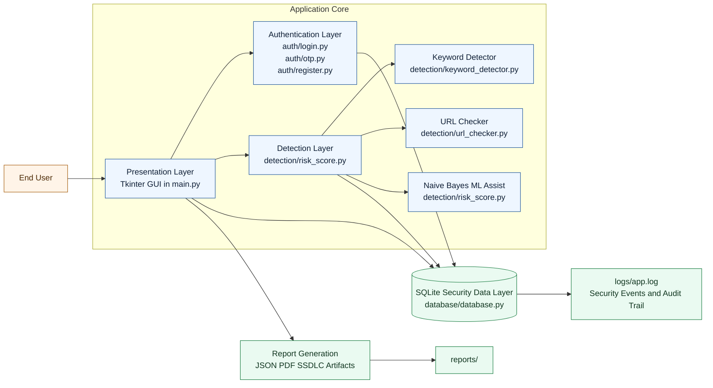
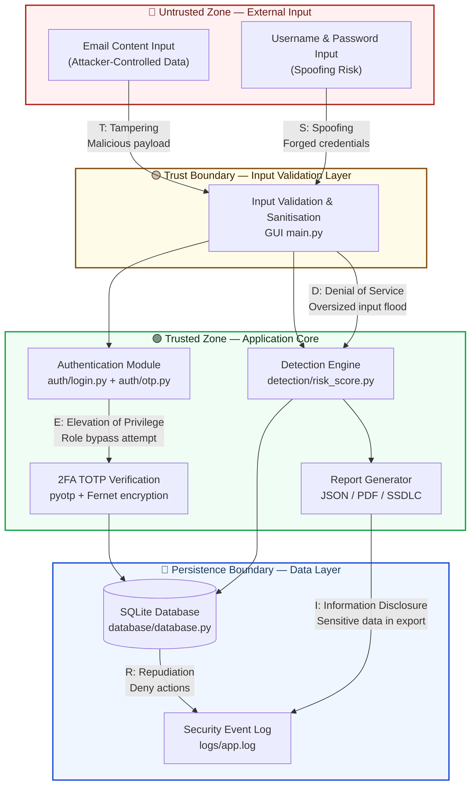
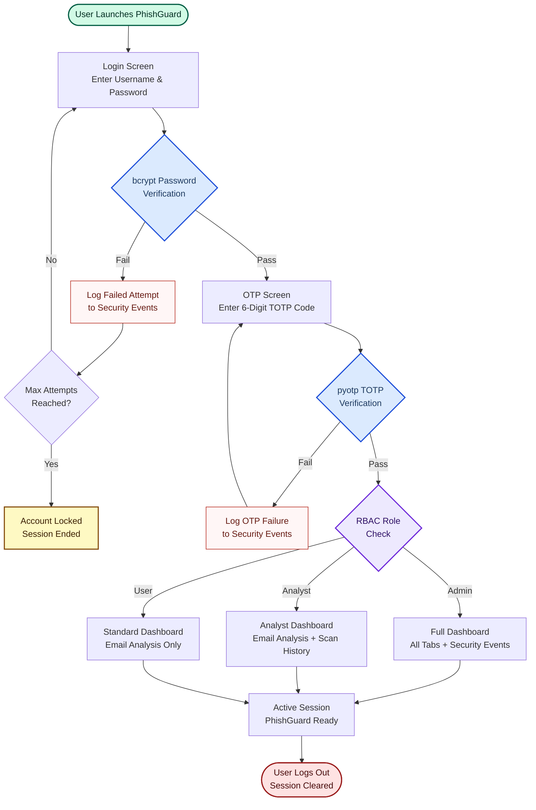
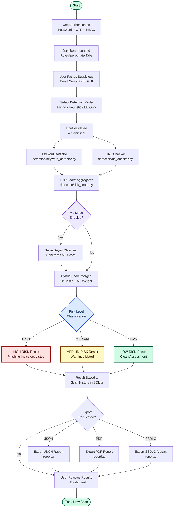
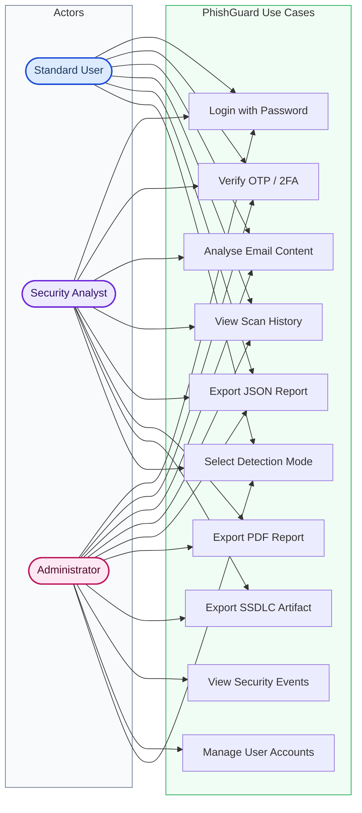

# PhishGuard Architecture Diagram

---

## Figure 1: Secure Software Development Lifecycle (SSDLC)

```mermaid
flowchart LR
    P["Phase 1\nRequirements & Planning\n───────────\n• Define security requirements\n• Identify stakeholders\n• Establish RBAC policy\n• Scope phishing threats"]
    T["Phase 2\nThreat Modelling\n───────────\n• Apply STRIDE model\n• Identify attack vectors\n• DFD data flow review\n• Prioritise risks"]
    D["Phase 3\nSecure Design\n───────────\n• Layered architecture\n• Trust boundary mapping\n• Least privilege design\n• Encryption strategy"]
    I["Phase 4\nSecure Implementation\n───────────\n• bcrypt password hash\n• Fernet TOTP encrypt\n• Input validation\n• Parameterised SQL"]
    S["Phase 5\nSecurity Testing\n───────────\n• Unit tests (3 pass)\n• SQL injection checks\n• Auth bypass testing\n• Risk score validation"]
    DEP["Phase 6\nDeployment & Hardening\n───────────\n• Virtualenv isolation\n• Dependency pinning\n• Secrets never hardcoded\n• Minimal permissions"]
    M["Phase 7\nOperations & Monitoring\n───────────\n• Security event log\n• Audit trail in SQLite\n• Failed login tracking\n• Scan history retention"]

    P --> T --> D --> I --> S --> DEP --> M --> P

    style P   fill:#dbeafe,stroke:#1d4ed8,color:#1e3a5f,stroke-width:2px
    style T   fill:#ede9fe,stroke:#6d28d9,color:#2e1065,stroke-width:2px
    style D   fill:#fce7f3,stroke:#be185d,color:#500724,stroke-width:2px
    style I   fill:#d1fae5,stroke:#065f46,color:#022c22,stroke-width:2px
    style S   fill:#fef9c3,stroke:#854d0e,color:#3b1f02,stroke-width:2px
    style DEP fill:#fee2e2,stroke:#991b1b,color:#450a0a,stroke-width:2px
    style M   fill:#e0f2fe,stroke:#0369a1,color:#082f49,stroke-width:2px
```

**Figure 1: Secure Software Development Lifecycle (SSDLC) followed in PhishGuard.**

Figure 1 illustrates the seven SSDLC phases used throughout the PhishGuard project. Security was integrated into every stage including planning, threat modelling, implementation, testing, deployment, and monitoring. Each phase feeds into the next in a continuous cycle, ensuring security is never treated as an afterthought but as a core requirement embedded at every level of development.

| Phase | Name | Key PhishGuard Activity |
|---|---|---|
| 1 | Requirements & Planning | Defined phishing detection scope, RBAC policies, and stakeholder security expectations |
| 2 | Threat Modelling | Applied STRIDE framework; identified spoofing, injection, privilege escalation threats |
| 3 | Secure Design | Designed layered architecture with trust boundaries, encryption, and least privilege |
| 4 | Secure Implementation | bcrypt hashing, Fernet encryption, parameterised SQLite queries, input validation |
| 5 | Security Testing | 3 unit tests, SQL injection checks, authentication bypass testing, risk scoring validation |
| 6 | Deployment & Hardening | Virtualenv isolation, dependency pinning, no hardcoded secrets, minimal permissions |
| 7 | Operations & Monitoring | Security event logging, failed login tracking, scan history audit trail in SQLite |

---

## High-Level Secure Architecture

## STRIDE Threat Model Diagram

**STRIDE Threat Mapping:**

| STRIDE Category | Label on Diagram | Attack Vector | PhishGuard Mitigation |
|---|---|---|---|
| **S** — Spoofing | Forged credentials | Fake username/password | bcrypt hashing + TOTP 2FA |
| **T** — Tampering | Malicious email payload | Injected script/SQL in email text | Input validation, parameterised SQL |
| **R** — Repudiation | Deny actions | User denies scanning malicious content | Timestamped security event log in SQLite |
| **I** — Information Disclosure | Sensitive data in export | OTP secret or hash leakage | Fernet encryption, no plaintext secrets |
| **D** — Denial of Service | Oversized input flood | Huge email bodies crashing parser | Input length cap in validation layer |
| **E** — Elevation of Privilege | Role bypass attempt | Standard user accessing admin events | RBAC checks enforced in GUI + DB layer |

## Short Explanation

- Presentation Layer handles user interaction and workflow control.
- Authentication Layer enforces password checks, OTP, and role policies.
- Detection Layer combines heuristic analysis with optional ML scoring.
- Data Layer securely stores users, scans, and security events.
- Reporting Layer exports JSON, PDF, and SSDLC evidence artifacts.
- Trust boundaries protect transitions from untrusted input to secure processing and storage.

---

## Figure 5: Secure Authentication and 2FA Workflow

**Figure 5: Secure Authentication and 2FA Workflow.**

Figure 5 demonstrates the secure authentication workflow implemented in PhishGuard. Users must pass password verification, OTP validation, and RBAC checks before access is granted. Failed attempts are logged to the Security Events audit trail. Role-based access control then determines which dashboard tabs and features are available to the authenticated user.

---

## Figure 6: System Workflow Diagram

**Figure 6: PhishGuard System Workflow Diagram.**

Figure 6 shows the complete end-to-end workflow of the PhishGuard system. From authentication through email submission, detection processing, risk classification, result storage, and optional report export. The detection engine combines heuristic keyword/URL analysis with optional Naive Bayes ML scoring to produce a final risk level classification.

---

## Figure 7: Use Case Diagram

**Figure 7: PhishGuard Use Case Diagram.**

Figure 7 presents the use case diagram showing interactions between the three system roles and available PhishGuard features. Standard Users can analyse emails and export basic reports. Security Analysts additionally export PDF and SSDLC artifacts. Administrators have full access including security event audit views and account management.

| Use Case | Standard User | Security Analyst | Administrator |
|---|---|---|---|
| Login with Password | ✅ | ✅ | ✅ |
| Verify OTP / 2FA | ✅ | ✅ | ✅ |
| Analyse Email Content | ✅ | ✅ | ✅ |
| View Scan History | ✅ | ✅ | ✅ |
| Export JSON Report | ✅ | ✅ | ✅ |
| Select Detection Mode | ✅ | ✅ | ✅ |
| Export PDF Report | ❌ | ✅ | ✅ |
| Export SSDLC Artifact | ❌ | ✅ | ✅ |
| View Security Events | ❌ | ❌ | ✅ |
| Manage User Accounts | ❌ | ❌ | ✅ |
