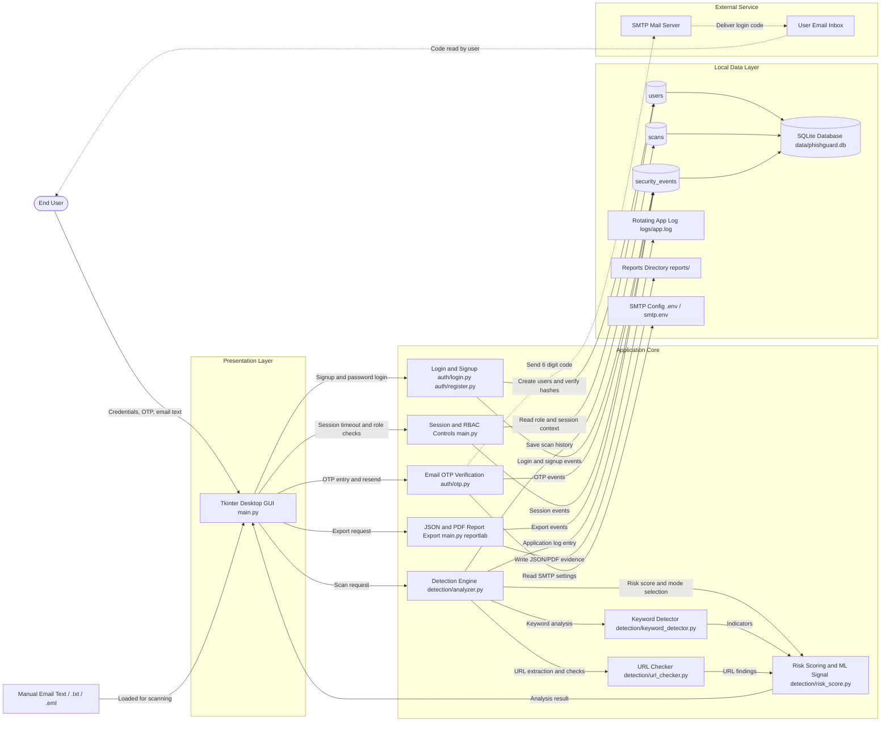
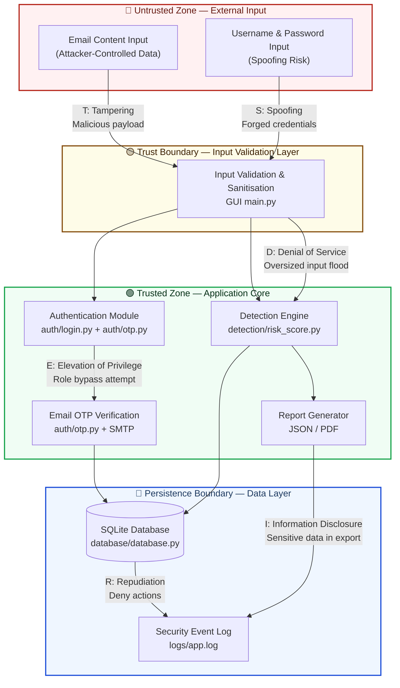
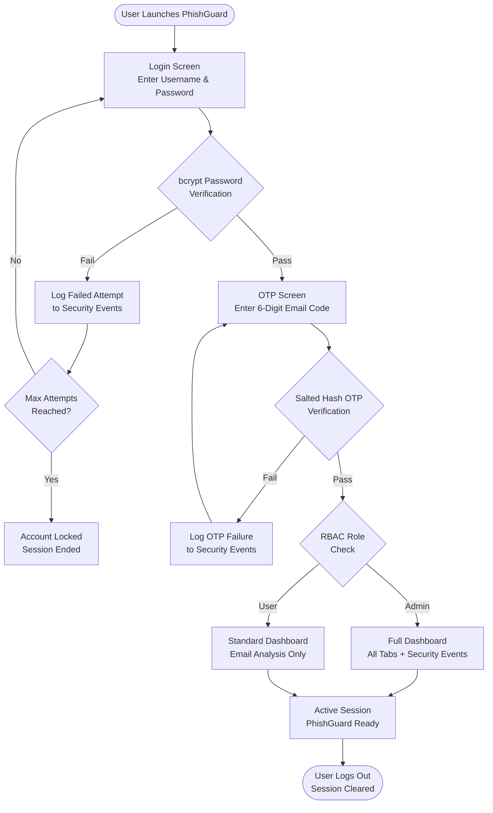
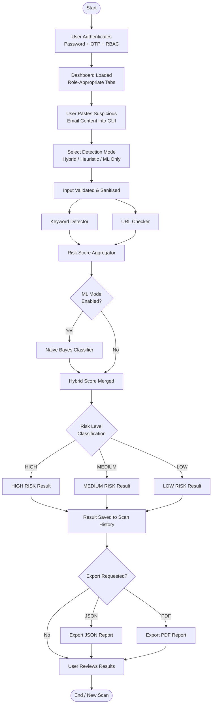
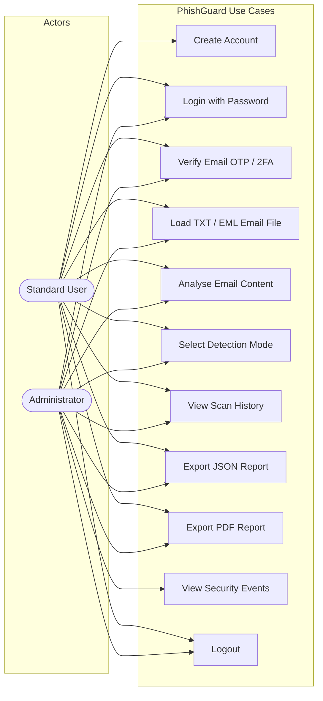
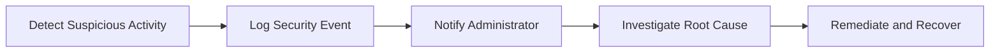

# PhishGuard: AI-Assisted Phishing Email Detection System

Unit: ICT306 - Advanced Cybersecurity  
Assessment 3 - Cybersecurity Project Implementation Following SSDLC  
Student Name: Marmik Karki  
Course: Bachelor of Information Technology (BIT)  
Semester: S1 2026

---

## Abstract

Phishing attacks remain one of the most dangerous cybersecurity threats affecting individuals and organizations worldwide. Cybercriminals use deceptive emails, fake websites, malicious links, and social engineering tactics to steal confidential information such as passwords, banking credentials, and personal data. The objective of this project was to design and implement a secure phishing email detection system called PhishGuard by following the Secure Software Development Lifecycle (SSDLC).

The system was developed using Python with a graphical user interface (GUI) that allows users to paste suspicious email content for analysis. The application analyzes email headers, phishing keywords, suspicious URLs, spoofed domains, insecure HTTP links, and social-engineering language patterns to determine phishing risk levels. The project also integrates secure authentication mechanisms, role-based access control (RBAC), two-factor authentication (2FA), secure coding practices, encrypted credential handling, and security logging.

Security controls were integrated throughout all SSDLC phases including threat modeling using STRIDE, secure design principles, secure implementation, security testing, deployment hardening, and monitoring. The final implementation successfully detected multiple phishing indicators and provided educational explanations to improve user awareness.

---

## 1. Introduction

### 1.1 Background

Phishing is a cyberattack technique where attackers impersonate legitimate organizations or trusted individuals to trick victims into revealing sensitive information. Attackers commonly use emails containing fake login pages, malicious attachments, urgent requests, and deceptive links. Traditional spam filters are often insufficient for modern phishing campaigns due to rapid attacker adaptation.

### 1.2 Problem Statement

Many users cannot easily identify phishing emails because attackers craft highly convincing messages. Existing filters may fail on advanced attempts involving:

- Spoofed domains
- URL obfuscation
- Social engineering language
- Credential harvesting links
- Malicious attachment lures
- Domain impersonation

### 1.3 Project Aim

To develop a secure phishing detector application that analyzes suspicious emails and identifies phishing indicators using cybersecurity-oriented detection and SSDLC practices.

### 1.4 Project Objectives

- Develop a GUI-based phishing detection application using Python.
- Implement secure login with RBAC and 2FA.
- Analyze suspicious URLs and domains.
- Detect phishing keywords and social engineering patterns.
- Perform secure input validation and sanitization.
- Integrate security controls across SSDLC phases.
- Perform security-focused testing.
- Generate phishing risk scores and security reports.
- Educate users through explainable output.

### 1.5 Scope

Included:

- Email content analysis
- Suspicious URL detection
- Risk scoring and classification
- RBAC authentication and 2FA
- Secure logging and report export
- Security testing evidence

Excluded:

- Live enterprise mail server integration
- Production cloud deployment

---

## 2. Literature Review

### 2.1 Phishing Attacks

Common phishing techniques include spear phishing, clone phishing, whaling, business email compromise (BEC), smishing, and vishing. These attacks rely heavily on urgency and trust exploitation.

### 2.2 OWASP Security Principles

Relevant controls applied in this project:

- Input validation and sanitization
- Secure authentication and session control
- Secure cryptographic storage
- Logging and monitoring
- Principle of least privilege

### 2.3 STRIDE Threat Modeling

STRIDE categories used for analysis:

- Spoofing
- Tampering
- Repudiation
- Information Disclosure
- Denial of Service
- Elevation of Privilege

### 2.4 Machine Learning in Phishing Detection

Machine learning can improve phishing detection by pattern analysis. This project includes a lightweight Naive Bayes model as an AI-assist signal combined with heuristic detection.

---

## Figure 1: Secure Software Development Lifecycle (SSDLC)

```mermaid
flowchart LR
    P["Phase 1\nRequirements & Planning\n───────────\n• Define security requirements\n• Identify stakeholders\n• Establish RBAC policy\n• Scope phishing threats"]
    T["Phase 2\nThreat Modelling\n───────────\n• Apply STRIDE model\n• Identify attack vectors\n• DFD data flow review\n• Prioritise risks"]
    D["Phase 3\nSecure Design\n───────────\n• Layered architecture\n• Trust boundary mapping\n• Least privilege design\n• Encryption strategy"]
    I["Phase 4\nSecure Implementation\n───────────\n• bcrypt password hash\n• Email OTP hashing\n• Input validation\n• Parameterised SQL"]
    S["Phase 5\nSecurity Testing\n───────────\n• Unit tests (3 pass)\n• SQL injection checks\n• Auth bypass testing\n• Risk score validation"]
    DEP["Phase 6\nDeployment & Hardening\n───────────\n• Virtualenv isolation\n• Dependency pinning\n• Secrets never hardcoded\n• Minimal permissions"]
    M["Phase 7\nOperations & Monitoring\n───────────\n• Security event log\n• Audit trail in SQLite\n• Failed login tracking\n• Scan history retention"]

    P --> T --> D --> I --> S --> DEP --> M --> P

    style P   fill:#dbeafe,stroke:#1d4ed8,color:#1e3a5f,stroke-width:2px
    style T   fill:#ede9fe,stroke:#6d28d9,color:#2e1065,stroke-width:2px
    style D   fill:#fce7f3,stroke:#be185d,color:#500724,stroke-width:2px
    style I   fill:#d1fae5,stroke:#065f46,color:#022c22,stroke-width:2px
    style S   fill:#fef9c3,stroke:#854d0e,color:#3b1f02,stroke-width:2px
    style DEP fill:#fee2e2,stroke:#991b1b,color:#450a0a,stroke-width:2px
    style M   fill:#e0f2fe,stroke:#0369a1,color:#082f49,stroke-width:2px
```



**Figure 1: Secure Software Development Lifecycle (SSDLC) followed in PhishGuard.**

Figure 1 illustrates the seven SSDLC phases used throughout the PhishGuard project. Security was integrated into every stage including planning, threat modelling, implementation, testing, deployment, and monitoring. Each phase feeds into the next in a continuous cycle, ensuring security is never treated as an afterthought but as a core requirement embedded at every level of development.

| Phase | Name | Key PhishGuard Activity |
|---|---|---|
| 1 | Requirements & Planning | Defined phishing detection scope, RBAC policies, and stakeholder security expectations |
| 2 | Threat Modelling | Applied STRIDE framework; identified spoofing, injection, privilege escalation threats |
| 3 | Secure Design | Designed layered architecture with trust boundaries, encryption, and least privilege |
| 4 | Secure Implementation | bcrypt hashing, salted OTP code hashing, parameterised SQLite queries, input validation |
| 5 | Security Testing | 3 unit tests, SQL injection checks, authentication bypass testing, risk scoring validation |
| 6 | Deployment & Hardening | Virtualenv isolation, dependency pinning, no hardcoded secrets, minimal permissions |
| 7 | Operations & Monitoring | Security event logging, failed login tracking, scan history audit trail in SQLite |

---

## 3. SSDLC Phase 1 - Security Requirements

### 3.1 Stakeholders and Security Expectations

| Stakeholder | Security Expectations |
|---|---|
| End Users | Accurate phishing detection and safe UX |
| System Administrator | Role-controlled access and audit visibility |
| Developers | Secure coding and maintainability |
| Organizations | Data confidentiality and integrity |

### 3.2 Security Requirements

Confidentiality:

- Short-lived OTP challenges with hashed codes
- Secure session handling
- RBAC control

Integrity:

- Input validation
- Event logging and scan history integrity

Availability:

- Stable local desktop operation
- Session handling and controlled processing

### 3.3 Compliance Alignment

- OWASP secure coding principles
- STRIDE threat modeling
- SSDLC phase-based implementation

### 3.4 Security Acceptance Criteria

- Invalid credentials and OTP are rejected.
- Passwords are hashed.
- OTP codes are short-lived and never stored in plaintext.
- Session timeout is enforced.
- Security events are logged.
- Malicious input patterns are blocked.

---

## 4. SSDLC Phase 2 - Threat Model

Detailed architecture page: see Architecture_Diagram.md in this reports folder.

### 4.1 System Architecture



Short explanation: The Tkinter GUI orchestrates authentication, OTP verification, role-based access, scanning, scan history, audit logging, and report exports. SQLite stores users, scan results, and security events; JSON/PDF evidence is written to the reports folder; OTP email delivery uses SMTP settings from environment or local config files.

### 4.2 Trust Boundaries and STRIDE Threat Model Diagram



**STRIDE Threat Mapping:**

| STRIDE Category | Label on Diagram | Attack Vector | PhishGuard Mitigation |
|---|---|---|---|
| **S** — Spoofing | Forged credentials | Fake username/password | bcrypt hashing + email OTP 2FA |
| **T** — Tampering | Malicious email payload | Injected script/SQL in email text | Input validation, parameterised SQL |
| **R** — Repudiation | Deny actions | User denies scanning malicious content | Timestamped security event log in SQLite |
| **I** — Information Disclosure | Sensitive data in export | OTP/config leakage | salted OTP challenge hashing, SMTP config outside source, no plaintext passwords |
| **D** — Denial of Service | Oversized input flood | Huge email bodies crashing parser | Input length cap in validation layer |
| **E** — Elevation of Privilege | Role bypass attempt | Standard user accessing admin events | RBAC checks enforced in GUI + DB layer |

Short explanation: Trust boundaries are enforced where untrusted content enters the app (Untrusted Zone → Validation Layer), where application logic runs (Trusted App Core), and where data is persisted (Persistence Boundary). Each STRIDE threat is explicitly labelled on the edge where it manifests.

### 4.3 STRIDE Analysis Summary

| Threat | Example Scenario | Mitigation |
|---|---|---|
| Spoofing | Fake login attempts | bcrypt password checks + OTP |
| Tampering | Report manipulation attempts | Audit logs and controlled exports |
| Repudiation | User denies suspicious actions | Timestamped security events |
| Information Disclosure | Secret leakage risk | OTP codes are hashed, short-lived, and kept out of persistent storage |
| DoS | Oversized malicious input | Input length validation |
| Elevation of Privilege | Standard user accesses admin events | RBAC checks in UI |

### 4.4 Risk Assessment

| Threat | Likelihood | Impact | Risk |
|---|---|---|---|
| Credential theft via phishing links | High | High | Critical |
| Malicious URL interaction | High | High | Critical |
| Unauthorized access | Medium | High | High |
| Script payload input | Medium | Medium | Medium |
| Application misuse / spamming | Medium | Medium | Medium |

---

## 5. SSDLC Phase 3 - Secure Design

### 5.1 Least Privilege

Roles:

- Admin
- Standard User

Only admin can fully view security audit events.

### 5.2 Defense in Depth

Implemented layers:

- Authentication layer
- OTP layer
- Input validation layer
- Detection layer (heuristic + ML)
- Logging and reporting layer
- Short-lived OTP challenge layer

### 5.3 Fail-Secure Behavior

- Invalid authentication fails closed.
- Invalid OTP is denied.
- Invalid input is rejected.
- Expired sessions force re-authentication.

### 5.4 Attack Surface Reduction

- No remote service exposed in local demo app.
- No executable attachment execution.
- Strict input size and pattern checks.
- Role-based gating of sensitive views.

---

## 6. SSDLC Phase 4 - Secure Implementation

### 6.1 Technologies

| Component | Technology |
|---|---|
| Programming Language | Python |
| GUI | Tkinter |
| Authentication | bcrypt, email OTP |
| OTP Delivery | smtplib with SMTP environment/config settings |
| Database | SQLite |
| Reporting | JSON, reportlab (PDF) |
| Testing | unittest |

### 6.2 Secure Authentication Code Snippet

```python
# database/database.py

def hash_password(password: str) -> str:
    return bcrypt.hashpw(password.encode("utf-8"), bcrypt.gensalt()).decode("utf-8")


def verify_password(password: str, password_hash: str) -> bool:
    try:
        return bcrypt.checkpw(password.encode("utf-8"), password_hash.encode("utf-8"))
    except ValueError:
        return False
```

Short explanation: Passwords are never stored in plaintext. Verification uses bcrypt hash comparison.

---

### Figure 5: Secure Authentication and 2FA Workflow



**Figure 5: Secure Authentication and 2FA Workflow.**

Figure 5 demonstrates the secure authentication workflow implemented in PhishGuard. Users must pass password verification, OTP validation, and RBAC checks before access is granted. Failed attempts are logged to the Security Events audit trail. Role-based access control then determines which dashboard tabs and features are available to the authenticated user.

---

### Figure 6: System Workflow Diagram



**Figure 6: PhishGuard System Workflow Diagram.**

Figure 6 shows the complete end-to-end workflow of the PhishGuard system. From authentication through email submission, detection processing, risk classification, result storage, and optional report export.

---

### Figure 7: Use Case Diagram



**Figure 7: PhishGuard Use Case Diagram.**

Figure 7 presents the use case diagram showing interactions between the two implemented system roles and available PhishGuard features. Standard Users can create accounts, authenticate, analyse emails, review scan history, and export reports. Administrators have the same scanning and reporting features, plus access to security event monitoring.

| Use Case | Standard User | Administrator |
|---|---|---|
| Create Account | Yes | No |
| Login with Password | Yes | Yes |
| Verify Email OTP / 2FA | Yes | Yes |
| Load TXT / EML Email File | Yes | Yes |
| Analyse Email Content | Yes | Yes |
| Select Detection Mode | Yes | Yes |
| View Scan History | Yes | Yes |
| Export JSON Report | Yes | Yes |
| Export PDF Report | Yes | Yes |
| View Security Events | No | Yes |
| Logout | Yes | Yes |

---

### 6.3 OTP Challenge Handling Snippet

```python
# auth/otp.py

def start_email_otp(email: str) -> EmailOTPChallenge:
    code = f"{secrets.randbelow(1_000_000):06d}"
    salt = secrets.token_hex(16)
    challenge = EmailOTPChallenge(
        email=email,
        salt=salt,
        code_hash=_hash_code(code, salt),
        expires_at=datetime.now(timezone.utc) + timedelta(seconds=OTP_TTL_SECONDS),
    )
    send_otp_email(email, code)
    return challenge


def _hash_code(code: str, salt: str) -> str:
    return hashlib.sha256(f"{salt}:{code}".encode("utf-8")).hexdigest()
```

Short explanation: The one-time code is sent by email, while only a salted hash of the code is kept in the active in-memory challenge. The challenge expires after five minutes and limits failed attempts.

### 6.4 Input Validation Snippet

```python
# main.py

def _sanitize_email_text(self, text: str) -> tuple[bool, str]:
    clean = text.replace("\x00", "").strip()
    if not clean:
        return False, "Email content is empty"
    if len(clean) > MAX_EMAIL_LENGTH:
        return False, f"Email is too large. Max {MAX_EMAIL_LENGTH} characters."
    if re.search(r"<\s*script", clean, flags=re.IGNORECASE):
        return False, "Script tags are blocked by input validation policy."
    return True, clean
```

Short explanation: Inputs are validated for emptiness, size, and potentially dangerous script payloads.

### 6.5 Risk Scoring Snippet

```python
# detection/risk_score.py

if normalized in {"heuristic", "hybrid"}:
    indicators.extend(_heuristic_indicators(email_text))
    heuristic_score = min(sum(item.points for item in indicators), 100)

if normalized in {"ml", "hybrid"}:
    ml_result = _ml_model.predict(email_text)
    ml_score = int(round(ml_result.phishing_probability * 100))
```

Short explanation: The system supports heuristic-only, ML-only, and hybrid scoring to balance explainability and adaptability.

### 6.6 Security Logging Snippet

```python
# database/database.py

def log_event(username: str | None, event_type: str, status: str, details: str) -> None:
    with _connect() as conn:
        conn.execute(
            """
            INSERT INTO security_events (username, event_type, status, details, created_at)
            VALUES (?, ?, ?, ?, ?)
            """,
            (username, event_type, status, details, _now()),
        )
```

Short explanation: Security-relevant actions are persisted for auditability and accountability.

---

## 7. SSDLC Phase 5 - Security Testing

### 7.1 Testing Approach

- Unit testing for detection modules.
- Authentication and OTP flow validation.
- Input validation checks.
- Role-based access behavior checks.

### 7.2 Test Evidence

Executed command:

```bash
python -m unittest tests/test_detection.py
```

Observed result:

- Ran 3 tests
- Status: OK

### 7.3 OWASP-Oriented Checks

| Vulnerability Area | Status | Notes |
|---|---|---|
| Broken Authentication | Mitigated | Password hashing + OTP |
| Input Injection Pattern | Mitigated | Script pattern blocked |
| Security Misconfiguration | Improved | Centralized secure defaults |
| Insufficient Logging | Mitigated | Security event logging implemented |

### 7.4 Remediation Summary

| Issue | Mitigation Implemented |
|---|---|
| Weak credential protection | bcrypt hashing |
| OTP code exposure risk | Salted code hash, 5-minute expiry, max attempts, SMTP config outside source |
| Unsafe input content | Validation and sanitization |
| Missing traceability | Event logging and scan history |

---

## 8. SSDLC Phases 6-7 - Deployment and Operations

### 8.1 Secure Deployment

- Local deployment for academic demonstration.
- Centralized dependency management via requirements file.
- Session timeout to reduce idle session risk.
- Separated folders for data, logs, and reports.

### 8.2 Incident Response Workflow



Short explanation: The app supports basic incident response by capturing events and enabling post-event review.

### 8.3 Monitoring and Logging

Monitored examples:

- Failed logins
- Failed OTP attempts
- Scan activity
- Report exports
- Session timeouts

### 8.4 Patch and Maintenance

- Update Python dependencies regularly.
- Review logs for anomaly trends.
- Extend test coverage as new features are added.

---

## 9. Results and Discussion

### 9.1 Functional Outcomes

Successful features in implementation:

- URL analysis
- Keyword detection
- Hybrid risk scoring
- Secure login with 2FA
- RBAC-driven visibility controls
- JSON/PDF report export
- Security logging and event history

### 9.2 Example Detection Case

Sample phishing content containing urgency phrases, URL shortener, and HTTP link produced a high score and was flagged as high/critical risk in hybrid mode.

### 9.3 Educational Value

Explanatory output helps users understand why content is suspicious, improving cyber awareness rather than only giving a binary pass/fail result.

---

## 10. Challenges Faced

- Detecting advanced phishing URL patterns
- Balancing false positives and false negatives
- Integrating secure authentication with a user-friendly GUI
- Coordinating multiple security controls in one local demo app

Resolution strategy:

- Iterative detection tuning
- Layered controls (RBAC, OTP, validation, logging)
- Incremental testing and modular refactoring

---

## 11. Future Enhancements

- Integrate threat intelligence APIs (VirusTotal, PhishTank)
- Add attachment malware scanning
- Add real-time mailbox monitoring
- Improve ML model with larger datasets
- Add cloud-native deployment profile
- Add richer analytics dashboard for SOC-style monitoring

---

## 12. Conclusion

This project successfully developed a secure phishing email detection system following SSDLC principles. PhishGuard integrates authentication security, phishing analysis, risk scoring, reporting, and audit logging in a single practical application. The outcome demonstrates that layered cybersecurity controls and secure software engineering practices can significantly reduce phishing-related risk while improving user awareness and response capability.

---

## 13. Screenshot Evidence Section

Insert your screenshots in reports/screenshots using the filenames below.

### SS01 - Project Structure

Short explanation: Shows the required assessment folder structure with auth, detection, database, logs, tests, and reports modules.

### SS02 - Login Screen

Short explanation: Demonstrates secure login UI with credential validation.

### SS03 - OTP Screen

Short explanation: Shows 2FA verification step before dashboard access.

### SS04 - Dashboard Input

Short explanation: User pastes suspicious email content and selects detection mode.

### SS05 - High-Risk Detection Result

Short explanation: Displays risk score, risk level, indicators, and explanation.

### SS06 - Detection Modes

Short explanation: Shows heuristic, ML, and hybrid mode options.

### SS07 - Scan History

Short explanation: Shows stored scan events with scores and timestamps.

### SS08 - Security Events (Admin)

Short explanation: Demonstrates role-based access to security audit logs.

### SS09 - JSON Export

Short explanation: Confirms successful JSON incident report export.

### SS10 - PDF Export

Short explanation: Confirms successful PDF report generation for assessment evidence.

### SS11 - Reports Folder

Short explanation: Shows generated artifacts including JSON, PDF, and SSDLC markdown files.

### SS12 - Test Execution Output

Short explanation: Verifies unit testing success.

---

## 14. Appendix A - File References

- main.py
- auth/login.py
- auth/register.py
- auth/otp.py
- detection/keyword_detector.py
- detection/url_checker.py
- detection/risk_score.py
- database/database.py
- tests/test_detection.py

## 15. Appendix B - Commands Used

```bash
pip install -r requirements.txt
python main.py
python -m unittest tests/test_detection.py
```
