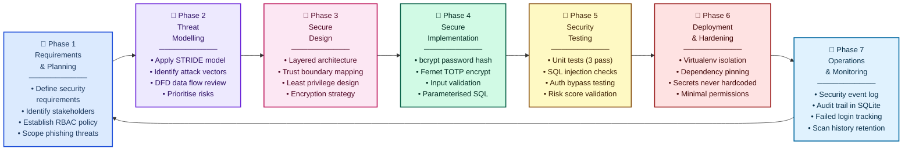

# Figure 1: SSDLC Lifecycle Diagram

## Figure 1: Secure Software Development Lifecycle (SSDLC) followed in PhishGuard

---

**Caption:** Figure 1: Secure Software Development Lifecycle (SSDLC) followed in PhishGuard.

**Explanation:** Figure 1 illustrates the seven SSDLC phases used throughout the PhishGuard project. Security was integrated into every stage including planning, threat modelling, implementation, testing, deployment, and monitoring. Each phase feeds into the next in a continuous cycle, ensuring security is never treated as an afterthought but as a core requirement embedded at every level of development.

| Phase | Name | Key PhishGuard Activity |
|---|---|---|
| 1 | Requirements & Planning | Defined phishing detection scope, RBAC policies, and stakeholder security expectations |
| 2 | Threat Modelling | Applied STRIDE framework; identified spoofing, injection, privilege escalation threats |
| 3 | Secure Design | Designed layered architecture with trust boundaries, encryption, and least privilege |
| 4 | Secure Implementation | bcrypt hashing, Fernet encryption, parameterised SQLite queries, input validation |
| 5 | Security Testing | 3 unit tests, SQL injection checks, authentication bypass testing, risk scoring validation |
| 6 | Deployment & Hardening | Virtualenv isolation, dependency pinning, no hardcoded secrets, minimal permissions |
| 7 | Operations & Monitoring | Security event logging, failed login tracking, scan history audit trail in SQLite |
